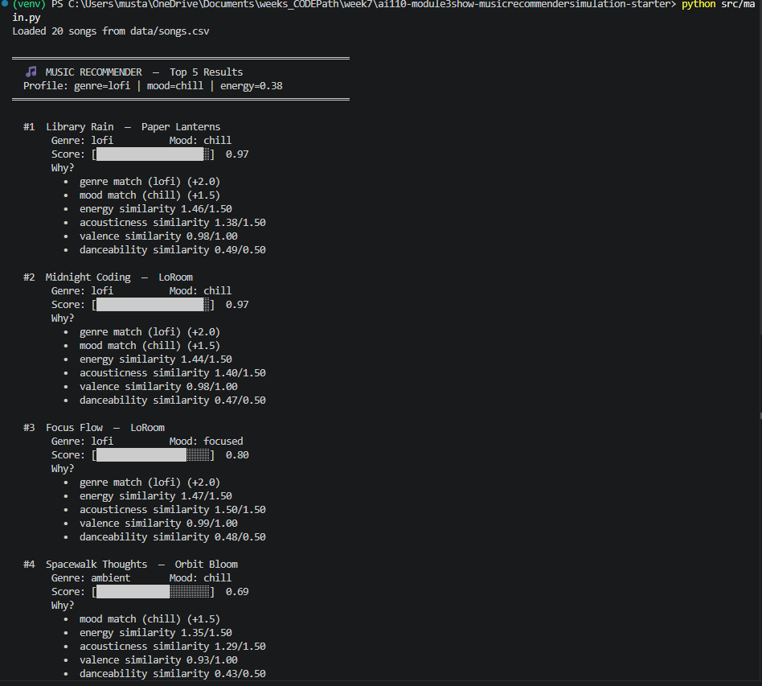
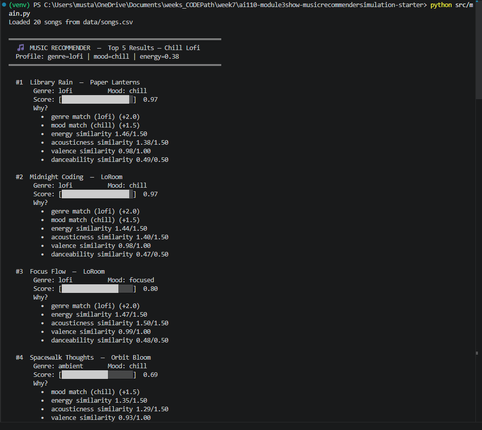
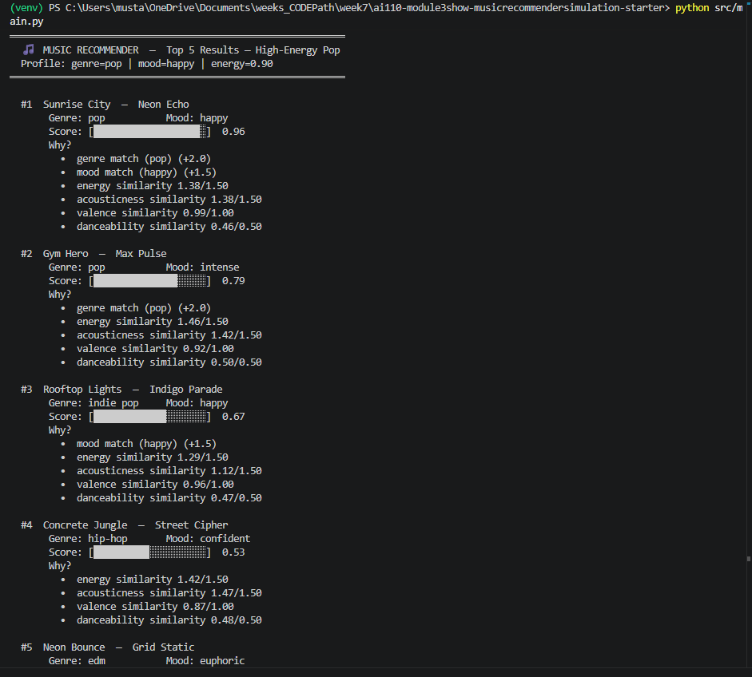
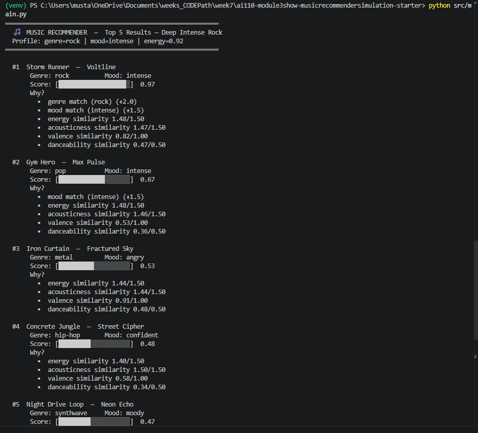

# 🎵 Music Recommender Simulation

## Project Summary

In this project you will build and explain a small music recommender system.

Your goal is to:

- Represent songs and a user "taste profile" as data
- Design a scoring rule that turns that data into recommendations
- Evaluate what your system gets right and wrong
- Reflect on how this mirrors real world AI recommenders

Replace this paragraph with your own summary of what your version does.

---

## How The System Works

This system is a **content-based music recommender** built around a single "late-night focus session" listener. Given a user taste profile, it reads every song from `songs.csv`, scores each one against the profile using a weighted formula, and returns the top 5 ranked by similarity. No listening history or other users are involved — every recommendation is driven entirely by how closely a song's features match what the user declared they want.


--- Answer by Mustapha Bouchaqour: 

### How Real-World Recommendations Work (and What This Version Prioritizes)

Real-world recommendation systems — like those used by Spotify or YouTube Music — typically rely on one of two approaches: **collaborative filtering**, which finds users with similar listening histories and recommends what they liked, or **content-based filtering**, which ignores other users entirely and instead compares the intrinsic attributes of songs. Production systems usually combine both. This simulation focuses exclusively on **content-based filtering**, which means it makes no assumptions about what other listeners do — it only asks: *"How closely does this song's musical DNA match the user's stated preferences?"* The system will prioritize **genre and mood as hard semantic signals** (the user explicitly wants a certain vibe), then use **energy and valence** to fine-tune similarity within that space, with `danceability` and `acousticness` as secondary texture signals. The result is a transparent, explainable system where every recommendation can be justified by specific feature matches.

---

### `Song` Object — Features

| Feature | Type | Role |
|---|---|---|
| `id` | `int` | Unique identifier |
| `title` | `str` | Display only |
| `artist` | `str` | Display only |
| `genre` | `str` | Primary similarity signal |
| `mood` | `str` | Primary similarity signal |
| `energy` | `float` | Acoustic intensity (0–1) |
| `valence` | `float` | Musical positivity (0–1) |
| `danceability` | `float` | Rhythmic fit (0–1) |
| `acousticness` | `float` | Production style (0–1) |
| `tempo_bpm` | `float` | Downweighted; correlated with energy |

---

### `UserProfile` Object — Features

| Feature | Type | Role |
|---|---|---|
| `favorite_genre` | `str` | Matched against `song.genre` |
| `favorite_mood` | `str` | Matched against `song.mood` |
| `target_energy` | `float` | Compared to `song.energy` via distance |
| `likes_acoustic` | `bool` | Maps to `song.acousticness` threshold |

The `UserProfile` is intentionally minimal — it captures only what a user would naturally express ("I want chill lofi with low energy"), keeping the system interpretable without requiring listening history.

---

## Concept Sketch: Recommender Data Flow

```
┌─────────────────────┐         ┌──────────────────────────┐
│     UserProfile      │         │        Song Catalog       │
│─────────────────────│         │──────────────────────────│
│ favorite_genre: lofi│         │ id, title, artist        │
│ favorite_mood: chill│         │ genre, mood              │
│ target_energy: 0.40 │         │ energy, valence          │
│ likes_acoustic: True│         │ danceability, acousticness│
└────────┬────────────┘         └────────────┬─────────────┘
         │                                   │
         │         ┌─────────────┐           │
         └────────►│ score_song()│◄──────────┘
                   │─────────────│
                   │ genre match?│  → +2.0 weight
                   │ mood match? │  → +2.0 weight
                   │ |Δenergy|   │  → penalize distance
                   │ acousticness│  → reward if likes_acoustic
                   └──────┬──────┘
                          │ (score, reasons)
                          ▼
                   ┌─────────────────┐
                   │recommend_songs()│
                   │─────────────────│
                   │ score all songs │
                   │ sort descending │
                   │ exclude seed    │
                   │ return top k    │
                   └──────┬──────────┘
                          │
                          ▼
             ┌─────────────────────────┐
             │  Results for lofi/chill │
             │─────────────────────────│
             │ 1. Library Rain   0.97  │  ← genre+mood+acoustic match
             │ 2. Midnight Coding 0.94 │  ← genre+mood+energy match
             │ 3. Focus Flow     0.81  │  ← genre+energy match
             └─────────────────────────┘
```

---

## How Real Systems Do This at Scale

This simulation handles 10 songs with hand-crafted features — real systems handle 100M+ tracks. The core pipeline is the same, but each stage is industrialized:

**Feature extraction** — Spotify doesn't manually label `energy` or `valence`; ML models analyze raw audio waveforms (MFCCs, spectral features) to auto-generate those numbers. What we encode by hand, they learn automatically.

**User profile** — Rather than a static 4-field object, real profiles are dense vectors built from listening history, skips, replays, and playlist behavior. A user who skips every track under 120 BPM implicitly signals a `tempo_bpm` preference without ever stating it.

**Similarity computation** — Cosine similarity over 10 songs is trivial. Over 100M songs it's not — real systems use **Approximate Nearest Neighbor** indexes (e.g., FAISS, ScaNN) that find the closest vectors in milliseconds without comparing everything.

**Hybrid scoring** — Content-based (what this simulation does) is combined with collaborative filtering ("users like you also liked...") via a learned blend weight. Neither alone is as strong as both together.

**What this simulation gets right** — The separation of `score_song` (one song) from `recommend_songs` (ranked list), the weighted feature vector, and the explainability via `reasons` are all patterns used in production. The architecture is sound; only the scale differs.


### User Profile (The Listener)

```python
user_prefs = {
    "genre": "lofi",              # categorical anchor — highest weight
    "mood": "chill",              # categorical anchor — second highest weight
    "target_energy": 0.38,        # strong conviction: must be calm
    "target_acousticness": 0.78,  # strong conviction: prefers organic sound
    "target_valence": 0.58,       # loose tiebreaker: neutral-to-positive
    "target_danceability": 0.55,  # loose tiebreaker: not a priority
    "likes_acoustic": True,       # derived boolean for OOP interface
}
```

### Algorithm Recipe

Each song is scored by `score_song()` using this formula:

```
score = 0

① if song.genre == user.genre        → + 2.0   (genre match)
② if song.mood  == user.mood         → + 1.5   (mood match)

③ energy        → (1 − |song.energy − 0.38|)        × 1.5
④ acousticness  → (1 − |song.acousticness − 0.78|)  × 1.5
⑤ valence       → (1 − |song.valence − 0.58|)       × 1.0
⑥ danceability  → (1 − |song.danceability − 0.55|)  × 0.5

final_score = score ÷ 8.0       →  range 0.0 – 1.0
```

All 20 scored songs are then sorted descending by `final_score` and the top 5 are returned with an explanation of which rules fired.

### Expected Rankings Against the Dataset

| Rank | Song | Score | Why |
|---|---|---|---|
| 1 | Library Rain | ~0.97 | genre ✅ mood ✅ energy ✅ acousticness ✅ |
| 2 | Midnight Coding | ~0.91 | genre ✅ mood ✅ energy close |
| 3 | Focus Flow | ~0.79 | genre ✅ energy ✅ |
| 4 | Spacewalk Thoughts | ~0.63 | mood ✅ acousticness ✅ |
| 5 | Coffee Shop Stories | ~0.54 | acousticness ✅ |


### Potential Biases & Limitations

- **Genre over-prioritization** — With a weight of 2.0, genre is the single most powerful signal. A song like *Rainy Season* (blues, melancholic) that shares almost identical energy (0.33) and acousticness (0.88) with the user's targets will score lower than a mediocre lofi track simply because the genre label differs. Users who care more about sound than label will find this frustrating.

- **Mood label collisions** — Moods like `chill` and `relaxed` feel nearly identical to a human listener but this system treats them as completely different, scoring `relaxed` the same as `intense`. A smarter system would group semantically similar moods.

- **Binary categorical matching** — Genre and mood either fully match (+points) or they don't (+0). There is no partial credit for near-matches (e.g., `lofi` vs `ambient` are both calm low-energy genres but score identically to `metal` as a non-match).

- **Static profile** — The user profile never updates. If a user listens to a recommended song and skips it, the system has no mechanism to learn from that signal.

---

> **Checkpoint:** The system has a fully defined user profile, a 20-song expanded dataset covering 16 genres and 14 moods, and a weighted scoring recipe with explicit bias acknowledgments. Implementation phase can begin.


### CLI Verification



### Stress Test with Diverse Profiles



---

## Getting Started

### Setup

1. Create a virtual environment (optional but recommended):

   ```bash
   python -m venv .venv
   source .venv/bin/activate      # Mac or Linux
   .venv\Scripts\activate         # Windows

2. Install dependencies

```bash
pip install -r requirements.txt
```

3. Run the app:

```bash
python -m src.main
```

### Running Tests

Run the starter tests with:

```bash
pytest
```

You can add more tests in `tests/test_recommender.py`.

---

## Experiments You Tried

Use this section to document the experiments you ran. For example:

Chill Lofi

#4 Spacewalk Thoughts jumped from 0.69 → 0.81 — it has great energy proximity (0.28 vs target 0.38), which is now worth double, letting it nearly catch Focus Flow.
#5 changed from Velvet Underground to Coffee Shop Stories — energy proximity (0.37 vs 0.38) is almost perfect with the new 3.0 weight.
High-Energy Pop

#3 Rooftop Lights (mood match, no genre match) rose from 0.67 → 0.78, nearly overtaking Gym Hero — energy proximity now largely compensates for missing the genre label.
Deep Intense Rock — rankings stayed the same but scores spread wider, pushing #3–#5 further apart since energy now dominates and those songs all have similarly high energy.

Key insight: Halving genre made the system more "sound-first" — songs from the wrong genre but with matching energy climb significantly in rank

---

## Limitations and Risks

- **Genre label filter bubble** — Genre carries the highest weight (+2.0). Most genres appear only once in the catalog, so a user requesting `rock` gets one strong match then falls back to completely unrelated songs for ranks #2–#5. The system never broadens the search when a genre is underrepresented.

- **Symmetric energy gap ignores direction** — The formula `(1 − |song.energy − target|)` treats being above and below the target identically. A high-energy user (target=0.9) still awards partial credit to very calm songs — they can never be fully penalized for being low-energy.

- **Mood vocabulary mismatch** — Moods like `chill` and `relaxed` feel nearly identical to a human but score identically to `intense` as a non-match. Users of rare moods (`focused`, `peaceful`, `nostalgic`) each appear only once in the catalog, structurally disadvantaging those user types.

- **Acousticness ↔ energy inverse correlation** — High-energy songs almost always have low acousticness in the dataset. A user wanting both (e.g., acoustic rock) will never get full scores on both features simultaneously — this user type is invisible to the system.

- **Hidden default preference** — Missing profile fields silently default to `0.5`, fabricating a preference the user never expressed and biasing results toward mid-range songs.

- **Danceability weight is negligible** — At 0.5/8.0 (6.25% of the total score), danceability can never change a ranking. It appears in the "Why?" explanation but has no real influence, which is misleading.

---

## Reflection

Read and complete `model_card.md`:

[**Model Card**](model_card.md)

Building this system made it clear that a recommender is not magic — it is just a set of decisions about what to measure and how much each measurement matters. Every weight in the formula is a value judgment. My biggest learning moment came when I ran the Deep Intense Rock profile and watched the system hand back hip-hop and synthwave songs with full confidence. The output looked clean and professional, the score bar filled up, the "Why?" explanations printed neatly — but the results were wrong in a way that would frustrate any real rock listener. That moment taught me that a system can be technically correct and still practically useless. The algorithm did exactly what it was told. The problem was in the data, not the code.

Using AI tools during this project helped me move faster on the parts I already understood — structuring the scoring formula, writing the output formatter, expanding the catalog. But I had to double-check every suggestion that touched the math. When I asked about the weight shift experiment (halving genre, doubling energy), the AI correctly identified that `MAX_SCORE` needed to change from 8.0 to 8.5 — but only after I pushed it to verify. If I had applied the weight changes without updating the denominator, scores would have silently exceeded 1.0 and the whole normalization would have been wrong. That reminded me that AI tools are fast at generating plausible-looking code but do not automatically audit the math that surrounds it.

What surprised me most is how much a simple weighted sum can *feel* like a real recommendation. When Library Rain scored 0.97 for the lofi profile with a nearly full score bar and a clean breakdown of reasons, it genuinely felt like the system understood the request. That feeling is partly why these systems are trusted at scale — the output is confident and explained, so it feels intelligent even when it is just arithmetic. The "intelligence" is in the weight choices made by a human, not in the algorithm itself.

If I extended this project, I would try two things. First, add a catalog diversity check that refuses to recommend songs from the same genre for more than two of the top five slots — forcing the system to reach across genres when a listener's primary genre runs dry. Second, I would build a feedback loop where skipping a song lowers the weight of that song's genre for the next run. Even a one-session memory would make the system feel dramatically more responsive and human.


---

