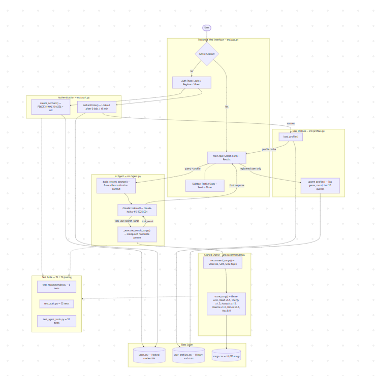
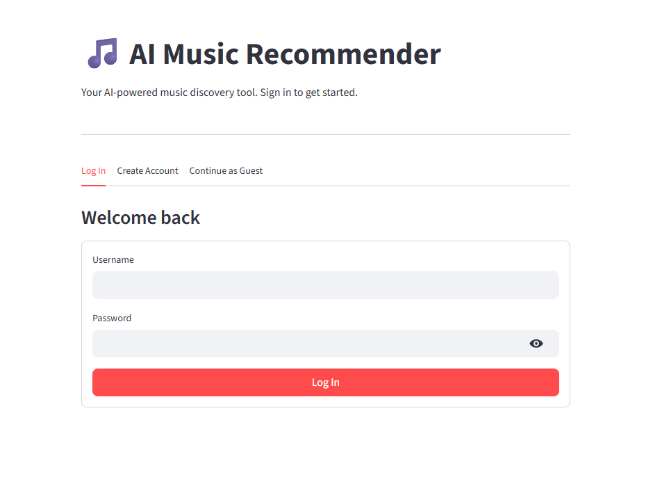
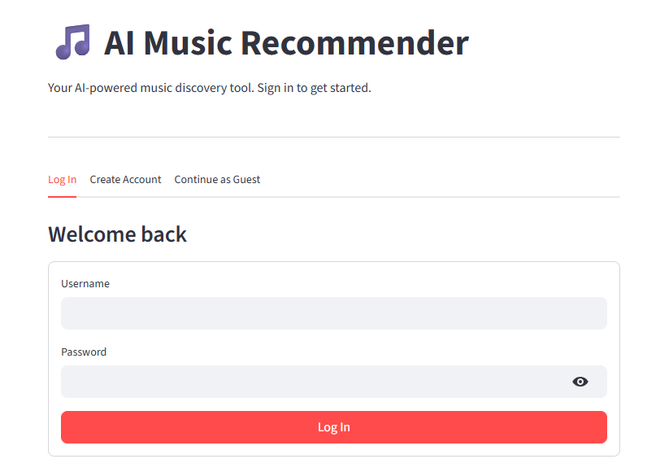
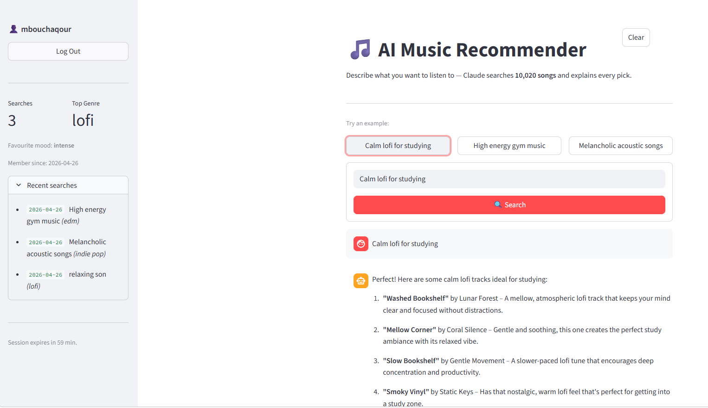
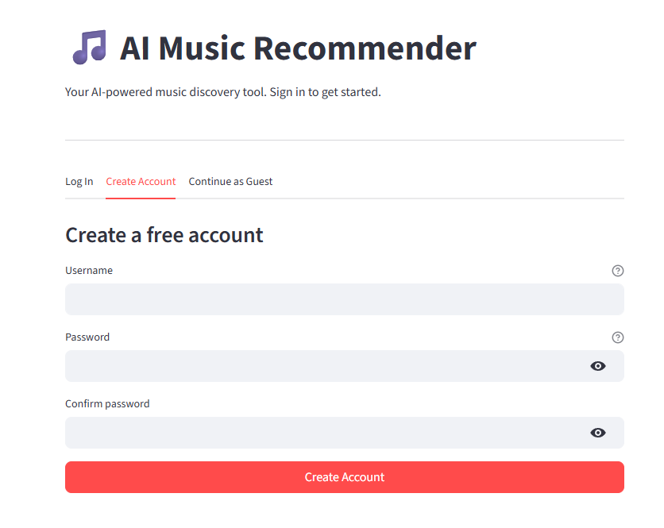
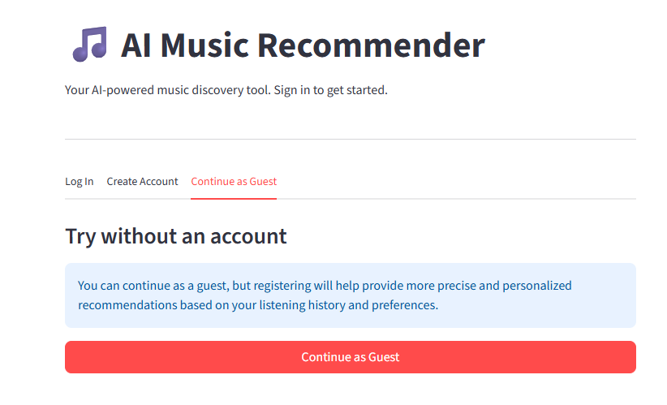
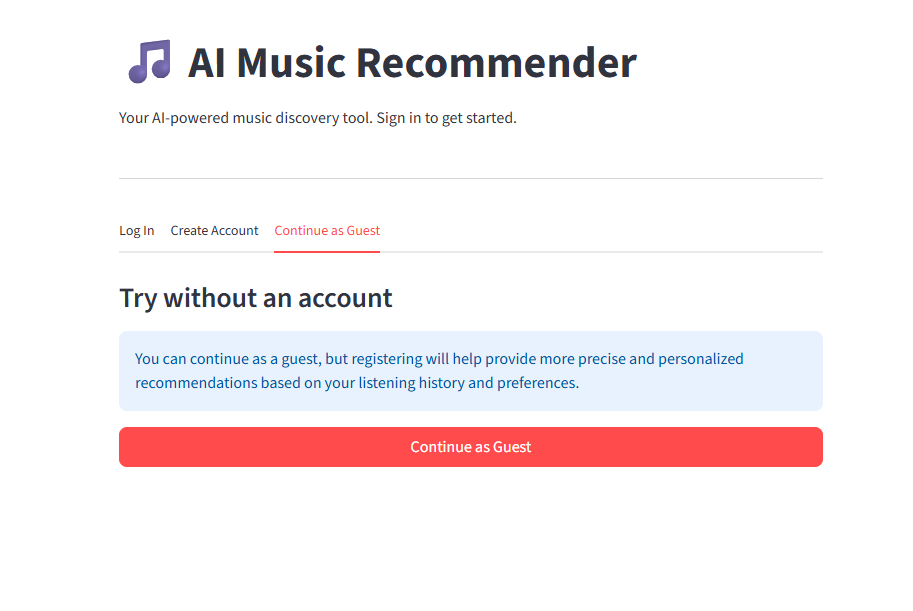
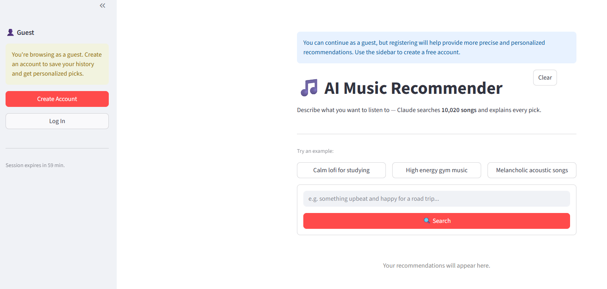

# AI Music Recommender — To Next Level

A conversational music discovery web app that lets users describe what they want to hear in plain English and receive personalized, explainable recommendations from a catalog of 10,020 songs — backed by a deterministic scoring engine and the Claude Haiku API.

---

## Demo Walkthrough

Watch the full end-to-end demo — authentication flow, 3 example queries, confidence scores, and personalization in action:

[](https://www.loom.com/share/87ff446f71fb4a6a9b830b80cd076793)

---

## Base Project

This system evolved from a rule-based CLI music recommender built in Modules 3. The original project took a hardcoded `UserProfile` dataclass (genre, mood, energy targets) and scored 20 songs using a weighted formula, returning the top matches with score breakdowns at the terminal.

**What changed across each evolution:**

| Stage | What was added |
|---|---|
| Modules 1–3 | Rule-based CLI recommender, 20-song catalog, `score_song` + `recommend_songs` logic |
| Step 1 | Claude Haiku API integration, `search_songs` tool, agentic loop, natural language input |
| Step 2 | Catalog expanded to 10,020 songs via `expand_songs.py`, Streamlit web UI |
| Step 3 | User authentication (register/login/guest), session management, account lockout |
| Step 4 | User profile persistence, sidebar stats, personalized recommendations from history |
| Step 5 | 70-test suite covering scoring engine, authentication, and agent internals |

---

## System Architecture



The architecture has five layers that communicate in sequence on every query:

1. **Streamlit Web Interface** (`src/app.py`) — handles session state, authentication tabs, sidebar stats, the search form, and rendering results.
2. **Authentication** (`src/auth.py`) — account creation with PBKDF2-HMAC-SHA256 hashing, login with failed-attempt tracking and 15-minute lockout, and guest access.
3. **AI Agent** (`src/agent.py`) — builds a personalized system prompt from the user's profile, calls the Claude Haiku API, and handles the `tool_use` / `tool_result` multi-turn loop.
4. **Scoring Engine** (`src/recommender.py`) — deterministic weighted feature scoring against the full catalog; Claude never generates the song picks directly.
5. **User Profiles** (`src/profiles.py`) — persists each registered user's history after every query and supplies that context back to the agent on the next request.

The full Mermaid source is in `Mermaid.js` at the project root.

---

## Project Structure

```
applied-ai-system-final/
├── src/
│   ├── app.py            # Streamlit web UI — auth flow, main app, sidebar
│   ├── agent.py          # Claude agentic loop with tool use + personalization
│   ├── auth.py           # Account creation, login, lockout, validation
│   ├── profiles.py       # Profile load/upsert — history, top genre/mood
│   ├── recommender.py    # Scoring engine: load_songs, score_song, recommend_songs
│   └── main.py           # Legacy CLI entry point
├── tests/
│   ├── conftest.py           # pytest sys.path setup
│   ├── test_recommender.py   # 6 scoring engine tests
│   ├── test_auth.py          # 32 authentication tests
│   └── test_agent_tools.py   # 32 agent edge-case tests
├── data/
│   ├── songs.csv             # 10,020-song catalog (tracked)
│   ├── users.csv             # Hashed credentials (gitignored)
│   └── user_profiles.csv     # User history and stats (gitignored)
├── assets/                   # UI screenshots and architecture diagram
├── Mermaid.js                # System architecture diagram source
├── model_card.md             # Bias documentation
├── requirements.txt
├── .env.example              # API key template
└── expand_songs.py           # Script that generated the 10,020-song catalog
```

---

## Setup and Installation

### Prerequisites
- Python 3.10+
- An Anthropic API key — [console.anthropic.com](https://console.anthropic.com)

### Steps

**1. Clone the repository:**
```bash
git clone https://github.com/MBouchaqour/applied-music-recommender-simulation-system-project.git
cd applied-music-recommender-simulation-system-project
```

**2. Create and activate a virtual environment:**
```bash
python -m venv venv

# Windows
venv\Scripts\activate

# Mac / Linux
source venv/bin/activate
```

**3. Install dependencies:**
```bash
pip install -r requirements.txt
```

**4. Set up your API key:**
```bash
cp .env.example .env
```
Open `.env` and replace the placeholder with your real Anthropic API key. Never edit `.env.example`.

**5. Run the app:**
```bash
streamlit run src/app.py
```
Open the URL shown in the terminal (usually `http://localhost:8501`).

---

## User Profile and CSV Storage

The system uses three CSV files in `data/`:

### `data/songs.csv` — Music Catalog (tracked in git)
10,020 songs with columns: `id`, `title`, `artist`, `genre`, `mood`, `energy`, `tempo_bpm`, `valence`, `danceability`, `acousticness`. Generated by `expand_songs.py` from a 20-song seed set using per-genre parameter ranges and word banks.

### `data/users.csv` — Credentials (gitignored)
Created automatically on first account registration. Columns: `username`, `password_hash`, `salt`, `created_at`, `failed_attempts`, `locked_until`.

- Passwords are hashed with **PBKDF2-HMAC-SHA256** (260,000 iterations) with a unique random salt per user — never stored in plaintext.
- Failed login attempts are tracked per account. After 5 consecutive failures the account is locked for 15 minutes.
- Lookups are case-insensitive; the canonical casing from registration is always preserved.

### `data/user_profiles.csv` — Interaction History (gitignored)
Created automatically on first query by a registered user. Columns: `username`, `first_seen`, `last_seen`, `query_count`, `last_query`, `top_genre`, `top_mood`, `history`.

- `history` is a JSON array of up to 20 recent interactions, each with `query`, `genre`, `mood`, and `timestamp`.
- `top_genre` and `top_mood` are recalculated from the full history on every upsert using a frequency count.
- **Upsert semantics:** if the username already exists, the row is updated in place; no duplicate rows are created.
- On every new query by a registered user, the latest profile is injected into the Claude system prompt so recommendations are biased toward the user's established taste.
- Both credential and profile files are gitignored to protect personal data.

---

## Running the Tests

```bash
pytest tests/ -v
```

Expected output: **70 passed**.

### Test Coverage

| File | Tests | What is covered |
|---|---|---|
| `test_recommender.py` | 6 | OOP `Recommender` class, `score_song` logic, `recommend_songs` output, `load_songs` data integrity |
| `test_auth.py` | 32 | `validate_username`, `validate_password`, `create_account` (success / duplicate / invalid), `authenticate` (success / wrong password / unknown user / lockout / reset / case-insensitive), `user_exists` |
| `test_agent_tools.py` | 32 | Empty input, invalid data types, missing profile, extremely long strings, special characters (emoji, SQL injection, HTML, unicode) across `_build_system_prompt`, `_execute_search_songs`, `score_song`, `recommend_songs`, and `load_songs` |

---

## Web Interface Screenshots

### Welcome Screen


### Login


### Login Result


### Create Account


### Continue as Guest






---

## Design Decisions

**Why Claude with tool use instead of a pure LLM response?**
Having Claude call a `search_songs` tool means the actual recommendations come from a deterministic scoring engine — not from the model's training data. Every result is auditable: you can inspect the confidence score and the `why` field for each song and verify exactly why it was chosen. A pure LLM would hallucinate song names or confidently recommend songs that don't exist in the catalog.

**Why keep the original scoring engine?**
The scoring engine is the heart of the original project. Rather than replacing it, the agent wraps it — Claude handles natural language interpretation while the engine handles consistent, reproducible scoring. This separation also means the engine can be tested completely independently of the AI layer.

**Why `claude-haiku-4-5` instead of a larger model?**
This task — interpret a music request, call one tool, write a short response — does not require deep reasoning. Haiku is fast and cheap, keeping the per-query cost well under a cent while still producing high-quality conversational responses.

**Why personalize from profile history instead of asking preferences upfront?**
Requiring users to fill out a preference form before every session creates friction and defeats the conversational nature of the app. Instead, preferences are inferred silently from past interactions and injected into the system prompt — the user experience stays natural while recommendations improve over time.

**Why CSV storage instead of a database?**
CSV is zero-infrastructure: no database server, no migrations, no connection strings. For a demo-scale app with a single writer this is entirely appropriate. The upsert pattern (read all → update dict → write all) makes the single-writer assumption explicit. The NOTE in `auth.py` documents what a production replacement would look like.

**Trade-offs:**
- Binary genre/mood matching gives no partial credit for semantically similar genres (lofi vs. ambient score the same as lofi vs. metal).
- The CSV single-writer pattern would break under concurrent writes at scale.
- Claude occasionally hedges too confidently — the system prompt asks for a confidence note, but the LLM tone can imply more certainty than the catalog depth justifies.

---

## Ethics and Responsibility

### Limitations and Biases
- **Genre filter bubble:** Songs from underrepresented genres dominate low-confidence results. A request for reggae gets one strong match then falls back to unrelated songs.
- **Binary categorical matching:** No partial credit for semantically similar genres or moods.
- **Profile cold start:** A new registered user gets the same recommendations as a guest for their first query — personalization only activates once history exists.
- **Catalog coverage:** 17 genres across 10,020 songs still leaves some genres with few representatives relative to others.

### Misuse Prevention
This is a music recommender — misuse potential is low. However, the pattern of using an LLM to interpret user intent and call a backend tool generalizes to more sensitive domains. In those contexts: (1) the tool must validate and sanitize all inputs from the LLM before executing, (2) the LLM should not have write access to any data store, and (3) logging should capture every tool call so misuse is detectable after the fact. This system follows all three practices.

### Data Privacy
User credentials are never stored in plaintext. Profile history is gitignored. Guest sessions produce no persistent data at all.

---

## Reflection

This project taught me that "using AI" and "building an AI system" are very different things. Calling an API is one line of code. Designing the boundary between what the LLM decides and what deterministic code executes — and making sure those two parts communicate cleanly — is the actual engineering work. The agentic workflow pattern (LLM as planner, existing code as tool) is powerful precisely because it keeps each part accountable to different standards: the LLM is evaluated on how well it interprets language; the scoring engine is evaluated on correctness and consistency.

Adding authentication and profile personalization showed how much infrastructure sits beneath even a simple "search" interaction: session state, credential storage, lockout logic, profile upsert semantics, and prompt injection — each a small system in its own right, each needing its own tests.

The hardest problem was not technical — it was knowing when to trust the AI's output. A confident-sounding recommendation with a 0.87 confidence score can be completely wrong if the catalog does not support the request. Building systems that communicate their own uncertainty honestly is as important as building systems that produce good results.
